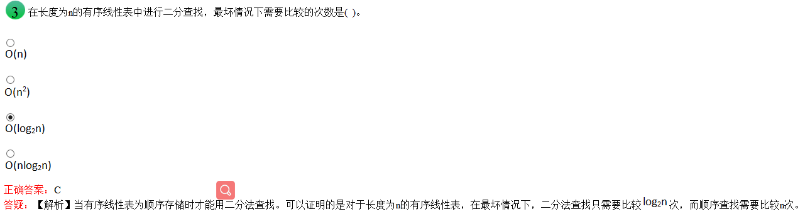

# C 题目常见问题

## 程序流程图

+ 箭头表示控制流
+ 矩形便是加工步骤
+ 菱形表示逻辑条件

## 数据流图

+ 带箭头的线段表示的时数据流

## 结构化程序设计基本原则

##### 自顶向下

> 程序设计时，应先考虑总体，后考虑细节；
>
> 先考虑全局目标，后考虑局部目标
>
> 不要一开始就过多追求众多的细节，先从最上层总目标开始设计，逐步使问题具体化

##### 逐步求精

> 对复杂问题，应设计一些子目标作为过渡，逐步细化

##### 模块化

> 一个复杂的问题，肯定是由若干少简单的问题构成，模块化是把程序要解决的总目标分解为子目标，再进一步分解为具体的小目标把每个小目标称为一个模块

## 模块划分的原则

#### 高内聚低耦合

> 一个完整的系统，模块与模块之间，尽可能的使其独立存在，让每个模块尽可能的独立完成某个特定的子功能，模块与模块之间的接口，尽量少而简单

##### 耦合性

> 块与块之间的联系，指软件系统结构中各模块相互联系紧密程度的一种度量。模块之前联系越紧密，其耦合性就越强，模块的独立性则越差
>
> 模块间耦合高低取决于模块间接口的复杂性、调用的方式及传递的信息

##### 内聚性

> 块内的联系，值模块的功能强度的度量
> 即一个模块内部各个元素彼此结合的紧密程序的度量。
>
> 若一个模块内各元素联系的越紧密，则它的内聚性就越高

## 软件开发流程

### 市场调研

> 可行性分析 （做还是不做）

### 需求分析

> 产生软件需求规格说明书 （做什么不做什么）

#### 使用的工具

+ DFD图
+ 数据字典DD
+ 判定树与判定表

### 概要设计

> 概要设计说明书

### 详细设计

> 详细设计说明书

### 编码

### 测试

> 集成测试计划

## 算法

> 算法是指解题方案的准确性而完整的描述，是一系列解决问题的清晰指令
>
> 算法代表用系统的方法描述解决问题的策略机制，也就是说能够对一定范围的输入，在有限时间内获得所要求的输出

### 评定

> 可以用空间复杂度和时间复杂度来衡量

#### 时间复杂度

> 算法的时间复杂度是指执行算法所需要的计算工作量。

#### 空间复杂度

> 算法的空间复杂度是算法需要消耗的内存空间

### 特征

#### 可行性

正对实际问题而设计的算法，执行后能够得到满意的结果

#### 有穷性

> 算法的有穷性是指算法必须能在执行有限个步骤之后终止 必须在有限的时间内完成

#### 确切性

> 算法的每一步骤必须有确切的定义，不允许有模棱两可的解释和多义性

#### 输入项

> 一个算法有0个或多个输入，以刻画运算对象的初始情况

#### 输出项

> 一个算法有一个获多个输出，以反映对输入数据加工后的结果，没有输入的算法是毫无意义的

#### 可行性

> 算法中执行的任何计算步骤都是可以被分解为基本的可执行操作中，即每个计算步都可以在有限时间内完成

## 三个关系的运算

### 交运算


## 算数运算

### 取模

+ 取模运算两边都必须为整性

  

## sizeof()函数

```
char p[] = {'1', '2', '3'}
*q = p;

seziof(p) // 计算的是数组p中所有元素所占用的字节数，而不是char型护具所占字节数
```

## 循环队列

### 结构

循环队列有队头愈合队尾两个指针，但循环队列任然是线性结构

### 元素变化情况

在循环队列中，需要队头和队尾来反映队列元素的动态变化

### 元素中的个数

循环队列中元素的个数是由队头指针和队尾指针共同决定的

## 查找



## 存储结构

### 顺序存储结构

> 存储一定是连续的


### 链式存储结构

> 存储不一定时连续的

### 存储空间

> 链式存储结构中每个节点都由数据域和指针域两部分组成，增加了存储空间

## 对象

### 基本特点

+ 标识唯一性

  每个对象都有自身唯一的标识，通过这种标识，可找到相应的对象。在对象的整个生命期中，它的标识都不改变，不同的对象不能有相同的标识。

+ 分类性

  分类性是指将具有一致的数据结构(属性)和行为(操作)的对象抽象成类。一个类就是这样一种抽象，它反映了与应用有关的重要性质，而忽略其他一些无关内容。任何类的划分都是主观的，但必须与具体的应用有关

+ 继承性

  继承性是子类自动共享父类数据结构和方法的机制，这是类之间的一种关系。在定义和实现一个类的时候，可以在一个已经存在的类的基础之上来进行，把这个已经存在的类所定义的内容作为自己的内容，并加入若干新的内容。

+ 多态性

  多态性使指相同的操作或函数、过程可作用于多种类型的对象上并获得不同的结果。不同的对象，收到同一消息可以产生不同的结果，这种现象称为多态性。
  多态性允许每个对象以适合自身的方式去响应共同的消息。
  多态性增强了软件的灵活性和重用性。